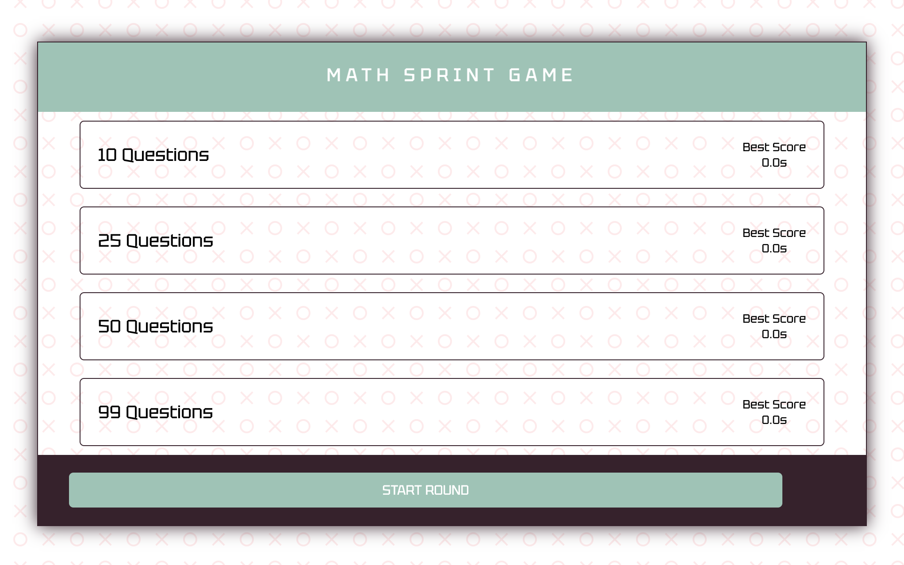
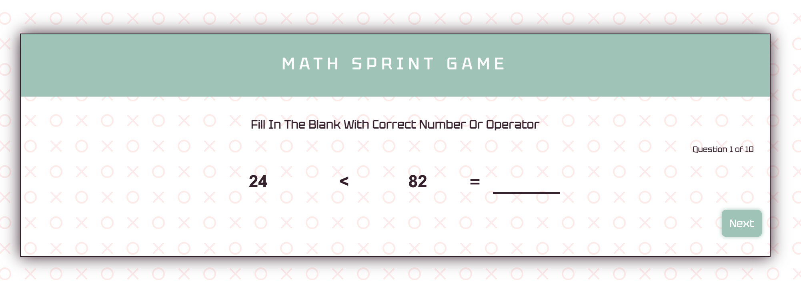
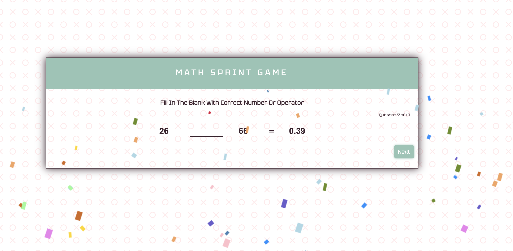
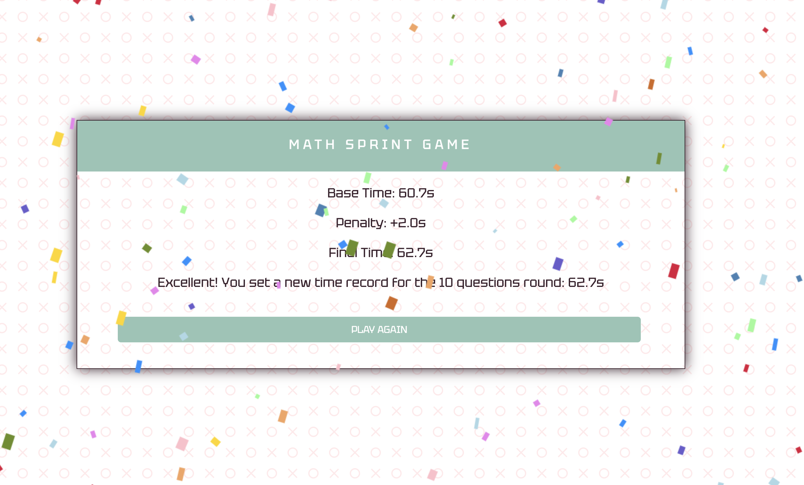

<!-- PROJECT LOGO -->
 

  
  <h3 align="center">Math Spring Game</h3>
  

     
    <a href="">View Demo</a>
    ·
    <a href="https://github.com/andreinadsc/math-spring-game/issues">Report Bug</a>
  

  
Table of Contents

  <ol>
    <li>
      <a href="#about-the-project">About The Project</a>
    </li>
    <li>
        <a href="#built-with">Built With</a>
    </li>
    <li>
      <a href="#getting-started">Getting Started</a>
    </li>
    <li><a href="#contact">Contact</a></li>
  </ol>

## About The Project

A simple math game with with vanilla js

(<a href="#readme-top">back to top</a>)

## Built With

* 
* 
* 

(<a href="#readme-top">back to top</a>)

<!-- GETTING STARTED -->

## Getting Started

To start the game you just have to select one of the rounds, you can choose between rounds of 10, 25, 50 and 99 questions.

You must answer each of the questions that appear, the more correct answers you get in the shortest amount of time the higher your score will be. You win a round if you manage to beat your current score.

<!-- CONTACT -->

## Contact

María Andreina Da Silva - andreinadsc@gmail.com

(<a href="#readme-top">back to top</a>)

